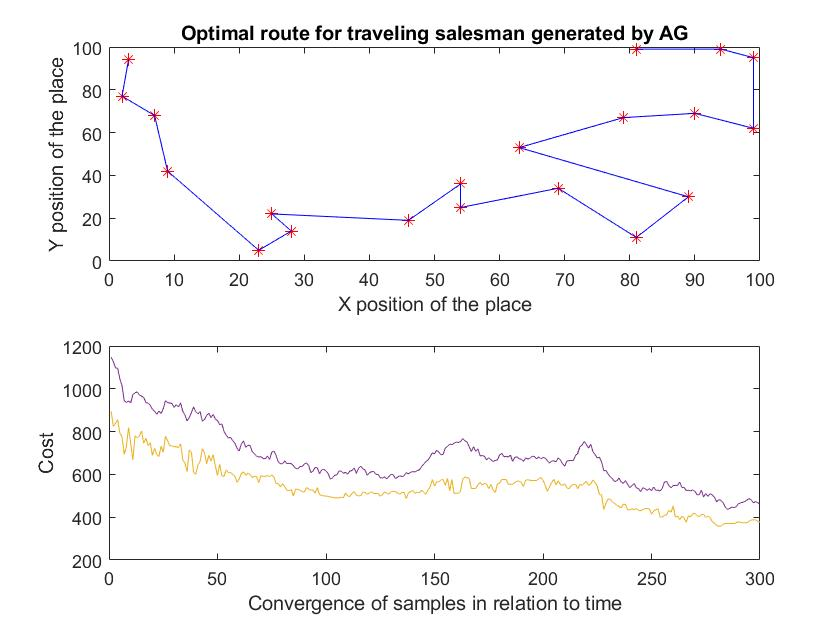

# **Genetic algorithm to generate the least cost route**

  

A genetic algorithm is presented that seeks to find the path with the least cost. This algorithm evolve a population of individuals by subjecting it to random actions similar to those that act in biological evolution **genetic mutations and recombinations**, the individual is the total path represented by blue lines. The selection of each individual is made according to some criteria, based on which it is decided which are the most adapted individuals **who survive** and which are the least fit **which are discarded**. This euristics is determined by the Euclidean distance between each red asterisk joined by a blue line.

 Genetic algorithm demo in MatLab 

  

---
This project was written in MatLab softwar. To run it: **open Saleman.m**

    To ensure the convergence of the algorithm modify the number of iterations
    Num_Pop=300;
    
    Run "Saleman.m"
    
    
---
 The path with lowest cost is generated by the algorithm as seen in the image 

  

---
# Notes

This work was developed in the chair ** Flexible Computing ** in 2017 at the University of La Salle
**Contact** EdgarStevenC - ecorrea00@unisalle.edu.co
